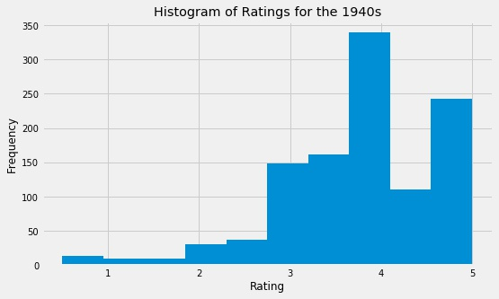
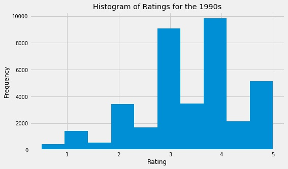

# Executive Summary

## Overview
The goal of this project is to __build a recommender engine in order to suggest what film someone should watch next__. The model has been trained on publicly available [datasets](https://grouplens.org/datasets/movielens/) from [MovieLens](https://www.movielens.org). The smaller of the available datasets was used in order to develop an engine based on data of manageable size.

Recommendations are made using pivot tables in order to hone in on cosine similarity between films. Essentially, each film is compared to every other film in the dataset (9,742 films) based on user ratings (100,836 ratings).

## Findings
During the exploratory data analysis (EDA), one of the most interesting findings was the fact that older films were more highly-rated on average than contemporary films. Perhaps society is only familiar with the "good" films of yesteryear. At the same time, it seems like we're constantly bombarded with ads for films like "The Hangover 7" (this is not an actual film... yet).

 
 

Subjectivity is at the crux of this problem. Shouldn't the user be the ultimate decider on which films are most similar? In the spirit of objectivity, the strength of cosine similarity is displayed with each returned search result. This feature gives the user a better feel for the weight of a given suggestion. The engine works best with popular films that have a higher number of ratings. On the other hand, less popular films have fewer ratings and tend to have lower cosine similarities

## Limitations and future work
As previously mentioned, one limitation is the recommender's dependence on a robust rating of each film. As a budding data scientist, I will state by default that more (good) data would help solve this problem.

There are several steps that can be taken to build on the current system. MovieLens has a much larger dataset available that can be used to build a more robust engine. One can look into sentiment analysis of user tags in order to develop a different idea of similarity. Features from IMDB can be used to help guide the user to other films by the same director, etc.
